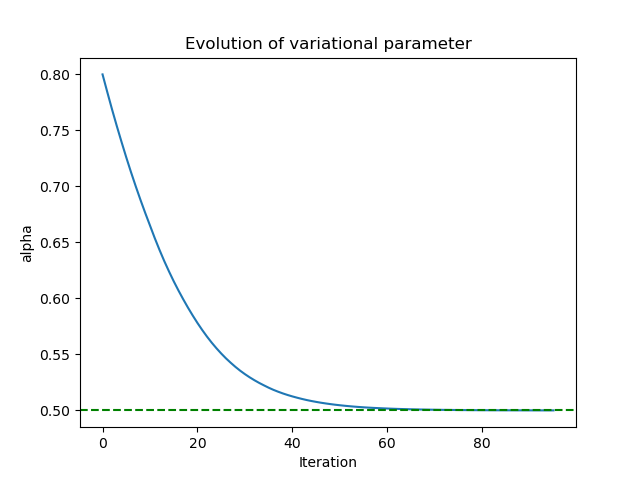
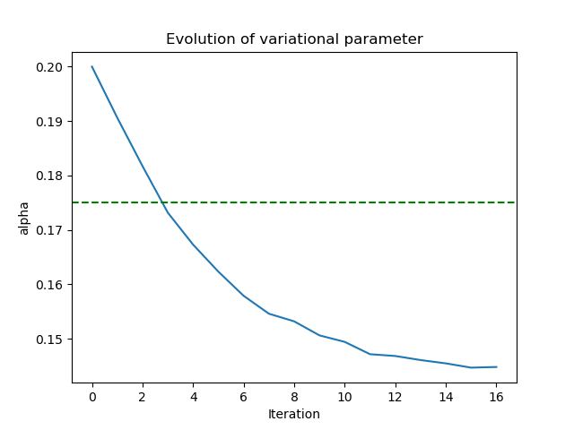

# Weekly progress journal

## Instructions

In this journal you will document your progress of the project, making use of the weekly milestones.

Every week you should 

1. write down **on the day of the lecture** a short plan (bullet list is sufficient) of how you want to 
   reach the weekly milestones. Think about how to distribute work in the group, 
   what pieces of code functionality need to be implemented.
2. write about your progress **until Tuesday, 11:00** before the next lecture with respect to the milestones.
   Substantiate your progress with links to code, pictures or test results. Reflect on the
   relation to your original plan.

We will give feedback on your progress on Tuesday before the following lecture. Consult the 
[grading scheme](https://computationalphysics.quantumtinkerer.tudelft.nl/proj1-moldyn-grading/) 
for details how the journal enters your grade.

Note that the file format of the journal is *markdown*. This is a flexible and easy method of 
converting text to HTML. 
Documentation of the syntax of markdown can be found 
[here](https://docs.gitlab.com/ee/user/markdown.html#gfm-extends-standard-markdown). 
You will find how to include [links](https://docs.gitlab.com/ee/user/markdown.html#links) and 
[images](https://docs.gitlab.com/ee/user/markdown.html#images) particularly.

## Week 1
(due 22 April 2025, 11:00)

*Start to implement a basic simulation to compute the expectation value of the energy for a given set of variational parameters, using the Metropolis algorithm. Argue why your approach fulfils detailed balance and make plans how to validate your code.*

- Discussed code structure including different functions and subroutines
- Set up functions.py file and main.py file (everybody)

General function structure including inputs and outputs and required data types were set up and defined.

- Fill in Metropolis function (Cesar)
- Fill in energy functions (Arturo)
- Set up optimization stream (Tim):

The Metropolis algorithm was implemented in [functions.py file.](https://gitlab.kwant-project.org/computational_physics/projects/Project2-QMC_Arturo_chernandodelaf_tneumann/-/blob/master/functions.py?ref_type=heads#L58-122), 
which calls the functions trial_wavefunction and probability_density. It was implemented for the cases of Quantum Harmonic Oscillator, Hydrogen and Helium (Helium is still in a experimental phase and we need to work more on it). 

In order to check and test the validity and good implementation of the algorithm, we created the [test_metropolis.py file.](https://gitlab.kwant-project.org/computational_physics/projects/Project2-QMC_Arturo_chernandodelaf_tneumann/-/blob/master/test_metropolis.py?ref_type=heads#L1-43). 
We found that for the parameter d = 1.5 (maximum displacement in the trial move), the acceptance ratio is roughly 0.5. We also plotted a histogram with the output samples of the metropolis algorithm and checked that they follow the desired probabilty distribution.

We first show that with d = 1.5, the metropolis algortithm explores most of the relevant position space:

{ width=300px }
{ width=300px }

We now plot the histograms:

{ width=300px }
{ width=300px }

An optimization stream was implemented in the [main.py file.](https://gitlab.kwant-project.org/computational_physics/projects/Project2-QMC_Arturo_chernandodelaf_tneumann/-/blob/master/main.py?ref_type=heads#L24-85) It accepts a Hamiltonian label (1d Harmonic oscillator and Hydrogen atom are functioning, Helium is experimental as of now) and various hyperparameters from the [parameters.py file,](https://gitlab.kwant-project.org/computational_physics/projects/Project2-QMC_Arturo_chernandodelaf_tneumann/-/blob/master/parameters.py?ref_type=heads) and performs a simple gradient-based optimization of the variational parameter (for the 1dHO and hydrogen trial functions, there is only one variational parameter to be optimized).
We find that the MCMC optimization scheme works for these simple Hamiltonians, where e.g. the optimization converges to alpha = 1 and a ground state energy of -0.5 for the hydrogen atom, in accordance with Thijsen (we need to verify the intermediate variances in comparison to Thijsen).

Most procedures and results, as the update of the parameter alpha, the convergence criteria or the local energies, are based on Chapter 12 from the book "Computational Physics" by J. Thijssen.

-- Convergence of optimization towards ground state energy including error bars indicating strength of variance (Hydrogen Hamiltonian)

{ width=300px }

-- Convergence of variational parameter towards alpha = 1 for the Hydrogen Hamiltonian optimization towards ground state energy including error bars indicating strength of variance

{ width=300px }

-- Convergence of optimisation towards ground state energy including error bars indicating strength of variance (Quantum Harmonic Oscillator)

{ width=300px }

-- Convergence of variational parameter towards alpha = 1/2 for the Quantum Harmonic Oscillator optimisation towards ground state energy including error bars indicating strength of variance

{ width=300px }

- Plan for verification: convert energies to SI unit to allow for literature comparison, compare energies and variance per alpha with Thijsen Ch. 12

*Edit: [Metropolis algorithm](https://gitlab.kwant-project.org/computational_physics/projects/Project2-QMC_Arturo_chernandodelaf_tneumann/-/blob/master/functions.py?ref_type=heads#L58-122) fulfills detailed balance*

In order to see why the Metropolis acceptance rule leads to detailed balance, first recall the general requirement of detailed balance: 
$$p(R)T(R\mapsto R') = p(R')T(R'\mapsto R).$$ Now the Metropolis transition rate is defined as $$T(R\mapsto R')=w_{RR'}A_{RR'},$$ where the trial move probabilities satisfy $w_{RR'} = w_{R'R}$, and the acceptance ratio is defined via cases as $$A_{RR'} = \begin{cases}1, \text{ if } p(R')>p(R) \\ \frac{p(R')}{p(R)}, \text{ if } p(R')<p(R). \end{cases}$$ Hence, we consider the two cases separately. 

Firstly, if $p(R')>p(R)$, then we have $$p(R)T(R\mapsto R') = p(R)w_{RR'}A_{RR'}=p(R)w_{RR'} = p(R')w_{RR'}\frac{p(R)}{p(R')} = p(R')w_{R'R}A(R'R) =p(R')T(R'\mapsto R),$$
where we have multiplied by $\frac{p(R')}{p(R')} = 1$ for equality $3$, used symmetry of trial moves as well as the acceptance rule $A_{R'R}$ (with $p(R')>p(R)$) for equality $4$, and applied the definition of the transition rate to obtain the final term. The chain of equalities verifies that detailed balance is satisfied with the given Metropolis update in the first case.

Secondly, if $p(R')<p(R)$, then we have $$p(R)T(R\mapsto R') = p(R)w_{RR'}A_{RR'}=p(R)w_{RR'}\frac{p(R')}{p(R)} = p(R')w_{RR'}= p(R')w_{R'R}A(R'R) =p(R')T(R'\mapsto R),$$ where we have used that $A(R'R) = 1$ for the case that $p(R')<p(R)$. Hence, detailed balance is satisfied in the second case as well.

As shown above, detailed balance is satisfied for both cases, completing the proof that the Metroloplis algorithm, and in particular its acceptance rule, satisfies this principle.

## Week 2
(due 29 April 2025, 11:00)

*Finish the basic simulation, monitor the acceptance ratio and validate your results.*

- Validate results for 1dHO and Hydrogen by comparing variances to Thijsen results (Tim)

We adapted the computation of the variance from inter- to intra- MCMC sample [computation](https://gitlab.kwant-project.org/computational_physics/projects/Project2-QMC_Arturo_chernandodelaf_tneumann/-/blob/master/functions.py?ref_type=heads#L224), such that we now effectively compute the variance of the local energies (as desired). Comparing our results to the table provided in Thijsen Ch.12, we find that both the energies and variances match almost perfectly
for all listed variational parameters (we inspected the numbers in our terminal output, but as a proof please refer to the plot of the Hydrogen case below).

-- Convergence of optimization towards ground state energy including error bars indicating strength of variance (Hydrogen Hamiltonian) 

{ width=300px}

We now plot the evolution of alpha for the Hydrogen Hamiltonian

{ width=300px}

-- Convergence of optimization towards ground state energy including error bars indicating strength of variance (QHO Hamiltonian)

{ width=300px}

We now plot the evolution of alpha for the QHO Hamiltonian

{ width=300px}

Therefore, we have confirmed that the variational parameter for both Hydrogen and QHO converges to the same value as in Thijssen, which corresponds to the ground state.

Furthermore, both energy graphs with respect to the variational parameter match with Thijssen results, validating our implementation.

- Improve code efficiency with regard to custom expectation value (Tim)

We refactored some code to make it more efficient, but we will need to put some more emphasis on this during the next week.
Currently, with reasonably large Gradient Descent size, we are able to run 30,000 samples with a 400 walkers (as in Thijsen),
but the performance can definitely still be optimized.

- Implement Helium atom: 
-- adapt functions for new trial function (Arturo)

The trial wave function proposed by J.Thijssen for the Helium atom was implemented. Its local energy and the routine update of the variational parameter alpha have also been added and tested (see [theory](https://gitlab.kwant-project.org/computational_physics/projects/Project2-QMC_Arturo_chernandodelaf_tneumann/-/blob/master/report_images/VQMC__CP_.pdf) for a quick theoretical derivation of the optimisation routine). 
When running the program, the value of alpha converges to around 0.145 and an average energy E around -2.88, a similar though slightly lower value than the one found by Thijssen. The variances (square of the standard deviations) match with those found by Thijssen. For this reason, the program is run twice: once starting from alpha=0.04, and once starting from alpha=0.12.
It is interesting to note that for the case of the Helium atom the standard deviations will not converge as the trial wavefunction now is not an exact solution for the Helium Hamiltonian. 
The fact that we do not find the same values as Thijssen could mean a certain unknown issue in the program, that still needs to be investigated.

-- Energy evolution of for the Helium atom in terms of alpha 

{ width=300px}
{ width=300px}

-- Evolution of the variational parameter alpha for the Helium atom 

{ width=300px}
{ width=300px}

-- vary d to determine MCMC step size to achieve an appropriate acceptance ratio (Cesar)

We found that the optimal d (maximum random displacement) such that the acceptance ratio of the Metropolis algorithm is roughly 0.5 is:
      -- d(Helium) = 0.5

      -- d(Hydrogen) = 1.45
      
      -- d(QHO) = 1.7

- Implemented function to convert energies to SI units (only for the Hydrogen) (Arturo)

*At the end of week 2, we now have a working MCMC algorithm to find the ground state energies of the Harmonic Oscillator, Hydrogen and Helium in accordance with the results in Thijsen. The next week shall be devoted to cleaning and refactoring our code such that it is more legible and performant.*

## Week 3
(due 6 May 2025, 11:00)

*Generate results for the Helium atom (including error bars) and start to implement the proper minimization of the energy.*

- Improved code efficiency by using numpy arrays wherever possible and test performance

We revised the code and conducted a performance test, comparing the run time of the algorithm with the number of generated MCMC samples. Here we found a linear relationship, as desired.

-- Performance analysis: Runtime vs. # of MCMC samples

{ width=300px}

- Cleaned code to remove redundancies

We change the code so to eliminate redundancies in the main.py file. More especifically, the three cases have been included in a while loop that only breaks if the desired conditions are met.
For the Hydrogen and the 1D QHO, the requirement is simply to get a standard deviation below a certain threshold (i.e. convergence); for the Helium, the convergence is given by the energies: if we observe more than 5 times in a row that the two last energy values are closer than a certain threshold, the system is considered to have converge.

- Compile comprehensive plots for energy vs. alpha

For the Helium we find:

{ width=300px}

{ width=300px}

- Finish SI unit conversion

After analysing the Hamiltonian, the SI unit conversion for the Helium exactly corresponds to that of the Hydrogen. 

- Start writing the report 

We started writing the report, adding the derivations for local energies and gradient optimisation.

-- Excerpt of report

{ width=300px}

- Revise the convergence criteria for Helium

We discussed the convergence criterion again. Now we define successful convergence as a sub-epsilon difference in energies over multiple iterations.

- Change plot of Helium to display convergence region rather than line

The region where the energy is found to be minimal is displayed in grey.

{ width=300px}

{ width=300px}

- Added comments in the code to explain the meaning of the variables and the logic of all the functions, so that an external person that has not worked on the project could get at least a high level understanding of the simulation.

## Reminder final deadline

The deadline for project 2 is **13 May 23:59**. By then, you must have uploaded the report to the repository, and the repository must contain the latest version of the code.